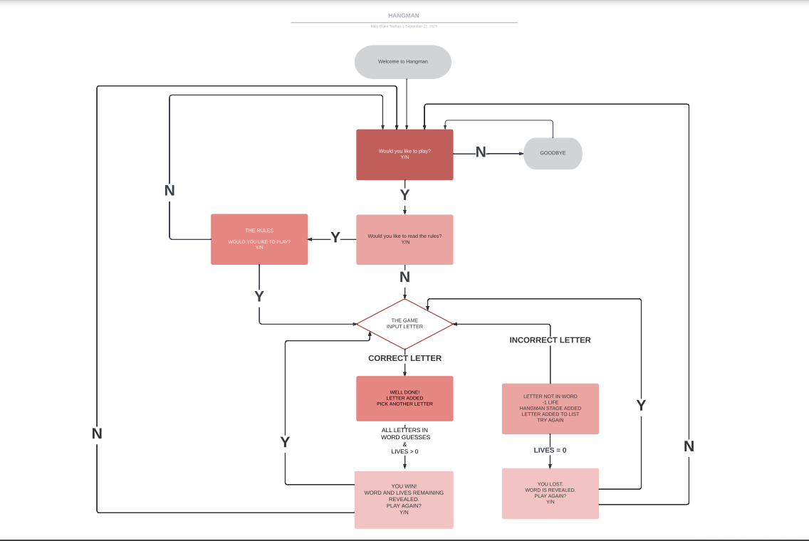

# HANGMAN
- [INTRODUCTION](#introduction)
- [USER EXPERIENCE UX](#user-experience-ux)
  * [USER STORIES](#user-stories)
- [SCOPE](#scope)
- [STRUCTURE](#structure)
- [FLOWCHART](#flowchart)
- [FEATURES](#features)
  + [EXISTING FEATURES](#existing-features)
  + [FUTURE FEATURES](#future-features)
- [LANGUAGES USED](#languages-used)
- [TECHNOLOGIES USED](#technologies-used)
- [DATA STORAGE](#data-sorage)
- [BUGS OR ERRORS](#bugs-or-errors)
- [UNFIXED BUGS](#unfixed-bugs)
- [TESTING](#testing)
- [MANUAL TESTING](#manual-testing)
- [DEPLOYMENT](#deployment)
- [CREDITS](#credits)
- [ACKNOWLEDGEMENTS](#acknowledgements)

## INTRODUCTION

In HANGMAN the player's objective is to guess the hidden word. The player has 10 lives to guess the word. If the player guesses a letter present in the word the letter will appear in the word section and they will move on to their next guess. If the player guesses a letter that is not present in the word they will lose one life and the Hangman starts to be built. Each incorrect letter brings the hangman closer to being built. If all the lives are spent before the word is guessed, the hangman is fully built and the player loses the game. If the player guesses the word before the lives are spent they win the game.

[The live project can be viewed here](https://maryclaireteahan-hangman-1cf25dd2c58c.herokuapp.com/)

## USER EXPERIENCE UX
### USER STORIES

As a general user, I want to:
1. Easily navigate through the game
2. Be able to understand the rules of the game.
3. See the correctness of the validation of my input values.
4. Be able to see what letters I have already selected.
5. Be able to see how many lives I have left

During the design, tests were carried out to try out visuals and initial features before establishing the final project repository.
## SCOPE
The project scope follows the minimal viable features approach for the initial project. However the scope is such that interactive features to enhance the user experience will be added in the future.
For the implementation of the ATM banking system I have planned the following features:
- Data from spreadsheet that contains the user's account and transactions to be displayed to the user in tables.
- Account creation starts from the beginning of the program if the user has no account.
- User account will be validated, if correct an option screen will be displayed to the user otherwise user will be referred back to create an account.
- The deposit option enables the user to add money to his/her account on passing the validation of the input data. The value of the amount, status, and date time is inserted into the transaction spreadsheet table.
- The withdraw option like the deposit option enables the user to remove money from his/her account if the amount input is valid. The amount requested by the user, status, and date time are inserted into the transactions spreadsheet table.
- The program displays warnings in all stages if input values are not given in the correct format.
- On-demand, a transaction table is displayed to the account holder if any, showing all his/her transactions with date time, amount, and status with reasons if the status is a failure.

## STRUCTURE
The user experience design is explicit, with features positioned conventionally. Navigation starts from the welcome message and intuitively exits the user if he wishes to.

### FLOWCHART
The Flowchart for my program was created using [LucidChart](https://lucid.app/lucidchart/0ea6b3ea-15d2-4224-8d87-f4cb79c1e504/edit?view_items=~A_qna7e~gO6%2CiA_qin-594Lj%2C-GCynUns-Lhk%2CWBCyDKANY6n8%2CtC_q.ugc0ykY%2C_GCyBuRiyuT8%2CUGaBpbitNrDr%2CNB_qjtwegra6%2CyN_qZtRYAS.k%2CQN_qc7A-Pjza%2C6ACyekr7hI1x%2CBO_qRQaICLUb%2CzO_qtwRH1phF%2CKO_q84z1~jpx%2CuxCyBT4_5jLN%2CRFCyzRnMuJP-%2CUO_q5KIubTSn%2CMO_qeyLKl4_R%2C2S_qwij~7oDz%2CFR_qFxsGLjv_%2C5R_q6sAcUmY5%2CMS_q.m.BR.cC%2C~S_qmapQ8_ev%2CrQ_qbucEDzrK%2CJECy.U-fqIgL%2CWACyobxv.xXf%2CVR_qYUxERad.&invitationId=inv_7aa4366a-6d4a-4551-b117-b9f5e4cd5eb2) and it visually represents how the system works.

## FEATURES
### EXISTING FEATURES
The program has a feature that will ease the work of bank workers by not taking the pains of registering every customer. Also, remove the hassle of customers creating accounts in banks.
For simulating a real-life experience, the system is linked to a <b>Google Spreedsheet</b> that can be accessed [here](https://docs.google.com/spreadsheets/d/19-2VbDweehojeCg4YcLQOBKUNskHD-2ef7-phK18IgQ/edit?usp=sharing).

- When the user launches the programm a welcome image is displayed with a question, if the user has an account or not.

- Any input error by the user is caught and the corresponding message is displayed.

- A no answer from the user will prompt the user to create an account.

- A yes answer implies the user has an account and the programm will prompt the user for validation of his/credentials thrice.
If the user is unable to give correct credentials the programm returns back to start welcome question state.

- If a user successfully logs in to the system, the option menu is displayed to the user.

- If the user chooses option 3, his/her account details are displayed in a table for the user.

- If the user chooses option 4, his/her transactions are shown on a table with the date time the transactions where made and there status.

- If the user chooses option 1, he/she will be promted to enter the amount in figures to deposit. The transaction will be inserted to the transaction table.

- If the user chooses option 2, he/she will be prompted to enter the amount in figures, all errors are caught by the programm and the transaction is inserted into the transaction table.

- If there is an input error from the user, the programm also checks the balance of the user if there are sufficient funds and if everything is ok the user is then allowed to withdraw funds consequently with a success message.

## DATA STORAGE

The data used in this project is stored in google sheet through the google api cloud platform

### FUTURE FEATURES
- Implement a more modern and secure way to save user's credentials
- Enable user's to do payment of utilities(water,gas, internet, telephone, etc)
- Implement an email message sent to customers about their current account weekly.

### LANGUAGES USED
- [Python](https://www.python.org/)

### TECHNOLOGIES USED
Git was used for version control.

[Gitpod](https://github.com/Code-Institute-Org/python-essentials-template) was used as the IDE

[Lucidchart](https://www.lucidchart.com/pages/landing?utm_source=google&utm_medium=cpc&utm_campaign=_chart_en_tier1_mixed_search_brand_exact_&km_CPC_CampaignId=1490375427&km_CPC_AdGroupID=55688909257&km_CPC_Keyword=lucidchart&km_CPC_MatchType=e&km_CPC_ExtensionID=&km_CPC_Network=g&km_CPC_AdPosition=&km_CPC_Creative=442433236001&km_CPC_TargetID=aud-809923745462:kwd-33511936169&km_CPC_Country=20483&km_CPC_Device=c&km_CPC_placement=&km_CPC_target=&gclid=CjwKCAiA2rOeBhAsEiwA2Pl7Q5KsmhzrrvhWJy2CYebbpJzHxt99Tj-XuCHr2wL0hH5yf4c1nGYkMhoCLYgQAvD_BwE) was used for the flowchart.

[pep8](https://pep8ci.herokuapp.com/) was used to validate the python code.

[Heroku](https://id.heroku.com/) was used to deploy the project.

### BUGS OR ERRORS
The following bug was found and squashed:

During the development process, the desire to give a good user experience was placed as the priority as a result, the code to achieve that aim was refactored several times. Finally, this was achieved, by introducing the function (do_options) and validating each user input in the (create_user) function.

### UNFIXED BUGS
There are no known outstanding bugs.

### TESTING

All the python files where tested in  [pep8](https://pep8ci.herokuapp.com/)

### MANUAL TESTING
Various users tested the atm application. Feedback was overall positive from all users.

The following functioned as intended:

- Account creation of user works correctly and inserts user credentials to google spreadsheet.
- Validation of user if prompted for credentials
- Shows a menu of options to a logged-in user
- The deposit function gives corresponding feedback depending on the user's input.
- Like the deposit function, the withdraw function also gives the corresponding feedback to the user depending on the input.
- On-demand users logged in can get details of their account or their transaction in a table.

The following were also tested and function correctly:
- Every input of users is validated, and the corresponding error/success message is displayed.
- The google spreadsheet is updated on every successful creation of an account.
- On every deposit or withdraw function call, the google spreadsheet is updated.
- The purpose of the application can be seen as the ease to create a user account.

## DEPLOYMENT
- This site was deployed by completing the following steps:
1. Log in to [Heroku](https://id.heroku.com/) or create an account
2. On the main page click the button labelled New in the top right corner and from the drop-down menu   select Create New App
3. You must enter a unique app name
4. Next select your region
5. Click on the Create App button
6. The next page is the project’s Deploy Tab. Click on the Settings Tab and scroll down to Config Vars
7. Click Reveal Config Vars and enter port into the Key box and 8000 into the Value box and click the Add button
8. Click Reveal Config Vars again and enter CREDS into the Key box and the Google credentials into the Value box
9. Next, scroll down to the Buildpack section click Add Buildpack select python and click Save Changes
10. Repeat step 9 to add node.js. o, Note: The Buildpacks must be in the correct order. If not click and drag them to move into the correct order
11. Scroll to the top of the page and choose the Deploy tab
12. Select Github as the deployment method
13. Confirm you want to connect to GitHub
14. Search for the repository name and click the connect button
15. Scroll to the bottom of the deploy page and select the preferred deployment type
16. Click either Enable Automatic Deploys for automatic deployment when you push updates to GitHUB

### FORKING 
Fork this project by following the steps:
1. Open [GitHub](https://github.com/)
2. Click on the project to be forked
3. Find the Fork button at the top right of the page
4. Once you click the button the fork will be in your repository

### CLONING
Clone this project by following the steps:
1. Open [GitHub](https://github.com/)
2. On the [repository](https://github.com/Dee68/milestone_project3) click the Code green button, right above the code window
3. You will be provided with three options to choose from, HTTPS, SSH, or GitHub CLI, click the clipboard icon in order to copy the URL
4. In your IDE open Git Bash
5. Enter the command git clone followed by the copied URL
6. The project is cloned.

## CREDITS
- The code for linking to the Google Spreadsheet and manipulating it was taken and adapted from the Code Institute Love Sandwiches tutorial
- The welcome message on the start of the programm was adapted from [ASCII Art generator](https://fsymbols.com/generators/carty/)
- The word_wrap function for animating the text was adapted from [Animated text tutorial](https://www.youtube.com/watch?v=2h8e0tXHfk0)
- The bank card and bank note images from [emoji](https://getemoji.com/)

## ACKNOWLEDGEMENTS
- My mentor Jack Wachira for his extraordinary insight, constructive criticism, encouragement, and continuous vital feedback.
- My code institute facilitator Irene Neveile for keeping up with my schedules.
- Friends and colleagues that helped in testing the application.

  