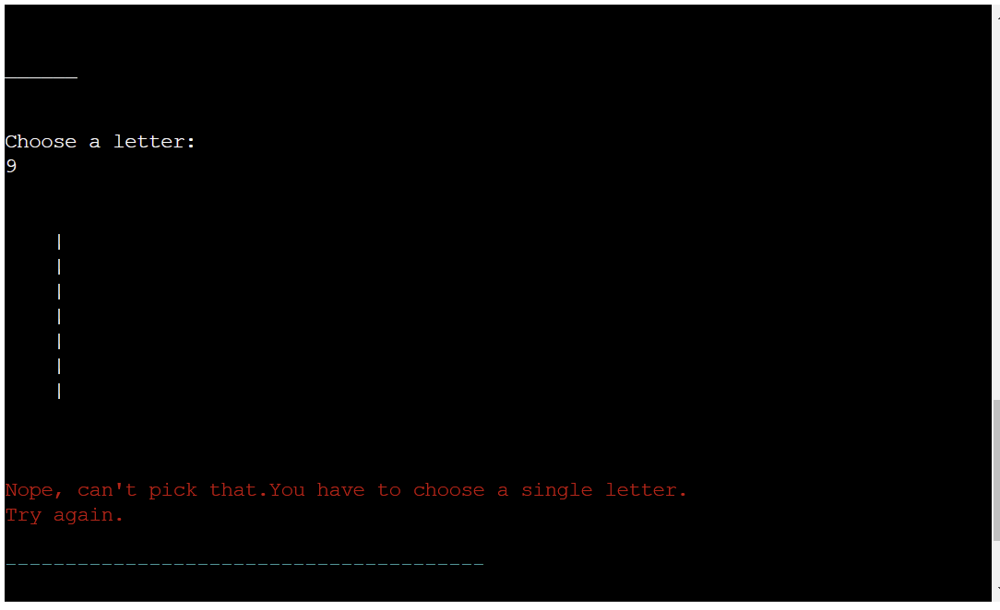

# **Hangman**

In HANGMAN the player's objective is to guess the hidden word. The player has 10 lives to guess the word. If the player guesses a letter present in the word the letter will appear in the word section and they will move on to their next guess. If the player guesses a letter that is not present in the word they will lose one life and the Hangman starts to be built. Each incorrect letter brings the hangman closer to being built. If all the lives are spent before the word is guessed, the hangman is fully built and the player loses the game. If the player guesses the word before the lives are spent they win the game.

  - [View the Live Website Here](https://maryclaireteahan-hangman-1cf25dd2c58c.herokuapp.com/)
## Table of contents 
* [Hangman](#hangman)
    * [User Experience](#user-experience)
        * [Project Goals](#project-goals)
        * [User Stories](#user-stories)
        * [Colors](#colors)
        * [Technology Used](#technology-used)
          * [Languages](#languages)
		  * [Libraries](#libraries)
    * [Flow Chart](#flow-chart)
    * [Features](#features)
    * [Testing](#testing)
        * [Testing User Stories](#testing-user-stories)
        * [Validation Testing](#validation-testing)
        * [Bugs](#bugs)
        * [Manual Testing](#manual-testing)
    * [Future Features](#future-features)
    * [Deployment](#deployment)
    * [Credits](#credits)

## User experience

### Project Goals

- The goal is to provide the user with a game that is fun as well as challenging. The user has to have a realistic opportunity to guess the word while also being reminded of the fact they have limited lives.

### User Stories

As a user, I want to:
- Be able to easily navigate through the game
- Be able to understand the rules of the game.
- Be able to see what letters I have already selected.
- Be told when I have input the same letter a second time.
- Be told when I have input an invalid character.
- Be able to see how many lives I have left
- Be told what the word is if I can't guess it.

### Colors

- The game features a colored header in the introduction as well as colored dividers after each input.When a Y/N input is required, Y/N is in green so the user will be more likely to realise those are their optiohns. When an invalid input has been entered the error handling is returned in red to draw the user's attention to the fact they have made an error.The countdown of the lives is colored differently. Lives 10-8 are green to show the user has plenty of lives left. Lives 7-4 is yellow to show the user is starting to run low. Lives 3-0 is red to imply urgency and that the user has to be careful how they choose their letters as they are about to die.

### Technology Used

- #### Languages:

   - Python

- #### Libraries
  * [Git](https://git-scm.com/)
    * Git was used for version control by utilizing the Gitpod terminal to commit to Git and push to GitHub
  * [GitHub](https://github.com/)
    * GitHub is used to store the project's code after being pushed from Git
  * [Heroku](https://id.heroku.com)
    * Heroku was used to deploy the live project
  * [Lucidchart](https://lucid.app/)
    * Lucidchart was used to creating the flowchart
  * [CI Python Linter](https://pep8ci.herokuapp.com/)
    * The PEP8 was used to validate all the Python code
  * [Patorjk](https://patorjk.com)
    * Patorjk (ASCII Art Generator) was used to create a banner across the game

## Flow Chart

Screenshots

The Flowchart for my program was created using [LucidChart](https://lucid.app/lucidchart/0ea6b3ea-15d2-4224-8d87-f4cb79c1e504/edit?view_items=~A_qna7e~gO6%2CiA_qin-594Lj%2C-GCynUns-Lhk%2CWBCyDKANY6n8%2CtC_q.ugc0ykY%2C_GCyBuRiyuT8%2CUGaBpbitNrDr%2CNB_qjtwegra6%2CyN_qZtRYAS.k%2CQN_qc7A-Pjza%2C6ACyekr7hI1x%2CBO_qRQaICLUb%2CzO_qtwRH1phF%2CKO_q84z1~jpx%2CuxCyBT4_5jLN%2CRFCyzRnMuJP-%2CUO_q5KIubTSn%2CMO_qeyLKl4_R%2C2S_qwij~7oDz%2CFR_qFxsGLjv_%2C5R_q6sAcUmY5%2CMS_q.m.BR.cC%2C~S_qmapQ8_ev%2CrQ_qbucEDzrK%2CJECy.U-fqIgL%2CWACyobxv.xXf%2CVR_qYUxERad.&invitationId=inv_7aa4366a-6d4a-4551-b117-b9f5e4cd5eb2). It is a visual representation of how the game works.

## Features
### Welcome screen

Screenshots

- Welcomes user to the game. Asks user whether or not they would like to play

### Second screen

Screenshots

- If user answered Y to the first screen they will be brought to the second screen. Here they are asked if they would like to see the rules.

### Rules screen

Screenshots

- If the user selected Y to the previous question they will be shown a list of rules for the game.

### Game screen

Screenshots

- 

### End game screen

Screenshots

Screenshots

- If the user managed to guess all the letters in the word before their lives ran out they are presented with a message of congratulations and are also let know how many lives they had left. If the user doesn't guess the word before their lives run out they will be presented with a message comiserating with them while also noting the full word. The hangman will also be fully completed.

## Testing

### Testing User Stories

 - Be able to asily navigate through the game

| **Feature**  | **Action**                  | **Expected Result**                                          | **Actual Result** |
| ------------ | --------------------------- | ------------------------------------------------------------ | ----------------- |
| Welcome screen | There is a input field inquiring if the user would like to play. | Type "Y" and move closer to the game play. | It works as expected |

Screenshots

- Be able to understand the rules of the game.

| **Feature** | **Action**                           | **Expected Result**                                           | **Actual Result** |
| ----------- | ------------------------------------ | ------------------------------------------------------------- | ----------------- |
| Rules screen | After the first "Y" the user is asked if they want to read the rules. The input requires either "Y" for yes or "N" for no | Type "Y" and the rules for the game are displayed. | It works as expected |

Screenshots

- Be able to see what letters I have already selected.

| **Feature** | **Action**                                         | **Expected Result**                            | **Actual Result** |
| ----------- | -------------------------------------------------- | ---------------------------------------------- | ----------------- |
| Game Play Screen | After each letter selection the letter is added to a list of guessed letters which is printed each round. | Each guessed letter is clearly visible after each round.| It works as expected |

Screenshots

- Be told when I have input the same letter a second time.

| **Feature** | **Action**                                 | **Expected Result**                                                                     | **Actual Result** |
| ----------- | ------------------------------------------ | --------------------------------------------------------------------------------------- | ----------------- |
| Game Play screen  | Input a letter that has already been guessed and is listed in the guessed letters section. | An error is printed stating that the letter has already been input. The user's lives are not effected. | It works as expected |

Screenshots

- Be told when I have input an invalid character.

| **Feature** | **Action**                                     | **Expected Result**                                                                | **Actual Result** |
| ----------- | ---------------------------------------------- | ---------------------------------------------------------------------------------- | ----------------- |
| Game Play screen | Input a character that is not a valid option i.e. anythine other than a letter from the alphabet. | A message appears telling the user that it was an invalid input. | It works as expected |

Screenshots

- Be able to see how many lives I have left.

| **Feature** | **Action**                                     | **Expected Result**                                                                | **Actual Result** |
| ----------- | ---------------------------------------------- | ---------------------------------------------------------------------------------- | ----------------- |
| Game Play screen  | Lives will decrease with each incorrect letter chosen. | The number decreases by one with each incorrect guess and the color will also change from green to yellow to read as the number decreases.| It works as expected |

Screenshots

- Be told what the word is if I can't guess it.

| **Feature** | **Action**                                     | **Expected Result**                                                                | **Actual Result** |
| ----------- | ---------------------------------------------- | ---------------------------------------------------------------------------------- | ----------------- |
| End game screen  | Lose the game. | When the user loses the game by running out of lives before they were able to guess the word, a message will appear telling them the word.| It works as expected |

Screenshots

 ### Validation Testing
- Used CI Python Linter to validate my code

Validated code

 ### Bugs
| **Bug**                                                                                                         | **Fix**                                                                                                                                                       |
| --------------------------------------------------------------------------------------------------------------- | ------------------------------------------------------------------------------------------------------------------------------------------------------------- |
| Couldn't get spaces between the underscores used for the unguessed letters of the word.| Redid the code to have no spaces between them.|
| Visual representation was confusing.  | Introduced colorama and add spacing to the print statements across the game       |
| Lines that were too long put through validator.                   | Run and formatted code through CI Python Linter                     |
| Game wouldn't work as colorama module wasn't found even though it had been installed                 |   Re- installed the colorama package using a different version of Pythog in case my IDE might have been set up to use a different version.                         
 ### Manual Testing
  #### Welcome screen

Screenshots

  - I tested the welcome page to make sure the only inputs accepted at "Y" or "N". If anything else is entered a warning message is produced.

 #### Rules screen 

Screenshots

   - I tested the rules page to make sure the only inputs accepted at "Y" or "N". If anything else for example, a number, a special symbol or a spaceis entered a warning message is produced.

 #### Game screen

Screenshots

  - I tested the game page to make sure the only inputs accepted are single letters from the alphabet. If anything else for example, a number, a special symbol or a spaceis entered a warning message is produced.

#### End game screen

Screenshots

  - I tested the end of game page to make sure the only inputs accepted at "Y" or "N". If anything else for example, a number, a special symbol or a space is entered a warning message is produced.

## Future Features
   - I would like to have levels of difficulty, the more difficult the level the fewer lives the user has.
   - I would like to have a hint feature that allows the user to ask for a hint in exchange for a life.
  
## Deployment

### How to clone the repository and push initial commit

- Go to the https://github.com/maryclaireteahan/hangman repository on GitHub 
- Click the "Code" button to the right of the screen, click HTTPs and copy the link there
- Open a GitBash terminal and navigate to the directory where you want to locate the clone
- On the command line, type "git clone" then paste in the copied url and press the Enter key to begin the clone process
- git add .
- git commit -m "Initial commit"
- git push

### Heroku
This project was deployed using Code Institutes mock terminal for Heroku.

- Log in to [Heroku](https://id.heroku.com/) or create an account
- On the main page click the button labelled New in the top right corner and from the drop-down menu   select Create New App
- You must enter a unique app name
- Next select your region
- Click on the Create App button
- The next page is the project’s Deploy Tab. Click on the Settings Tab and scroll down to Config Vars
- Click Reveal Config Vars and enter port into the Key box and 8000 into the Value box and click the Add button
- Click Reveal Config Vars again and enter CREDS into the Key box and the Google credentials into the Value box
- Next, scroll down to the Buildpack section click Add Buildpack select python and click Save Changes
- Repeat step 9 to add node.js. o, Note: The Buildpacks must be in the correct order. If not click and drag them to move into the correct order
- Scroll to the top of the page and choose the Deploy tab
- Select Github as the deployment method
- Confirm you want to connect to GitHub
- Search for the repository name and click the connect button
- Scroll to the bottom of the deploy page and select the preferred deployment type
- Click either Enable Automatic Deploys for automatic deployment when you push updates to GitHUB

## Credits
- Code & Content
  - I give credit to [Stack overflow](https://www.stackoverflow.com/), [MDN Web Docs](https://developer.mozilla.org/en-US/) & [W3 Schools](https://www.w3schools.com/) for helping me resolve issues with Python while coding through
  - Inspiration and guidance/problem solving through project came from [kite](https://www.youtube.com/@KiteHQ), [Sanjin Dedic](https://www.youtube.com/@SanjinDedic), [Tech with Tim](https://www.youtube.com/@TechWithTim) 
   youtube channels, and [Geeksforgeeks](https://www.geeksforgeeks.org/), [Codefather](https://codefather.tech/) websites
  - Credits for code os.system('cls' if os.name == 'nt' else 'clear') that clear screen was found on [stackoverflow](https://stackoverflow.com/questions/2084508/clear-terminal-in-python)
  - Credits for my hangman art go to  [Ascii](https://ascii.co.uk/art/hangman)
  - To create banner for my page with title name I used [Patorjk](https://patorjk.com/)
  - Giving credit to [Lucid chart](ttps://www.lucidchart.com/) for providing tools to easily create my flow chart
  - Credits for centering my content in the terminal with the code  os.get_terminal_size().columns goes to [Geeksforgeeks](https://www.geeksforgeeks.org/)

  - The code for linking to the Google Spreadsheet and manipulating it was taken and adapted from the Code Institute Love Sandwiches tutorial
  - The welcome message on the start of the programm was adapted from [ASCII Art generator](https://fsymbols.com/generators/carty/)
  - The word_wrap function for animating the text was adapted from [Animated text tutorial](https://www.youtube.com/watch?v=2h8e0tXHfk0)
  - The bank card and bank note images from [emoji](https://getemoji.com/)

- Acknowledgment
  - Thank you to my mentor Lauren-Nicole who gave me great advice and feedback on how to plan and execute this project and who provided me with lots of pointers on resources to help with coding and testing.
  - I would also like to thank our class facilitator Marko from Code Institute for giving advice on this project.

  